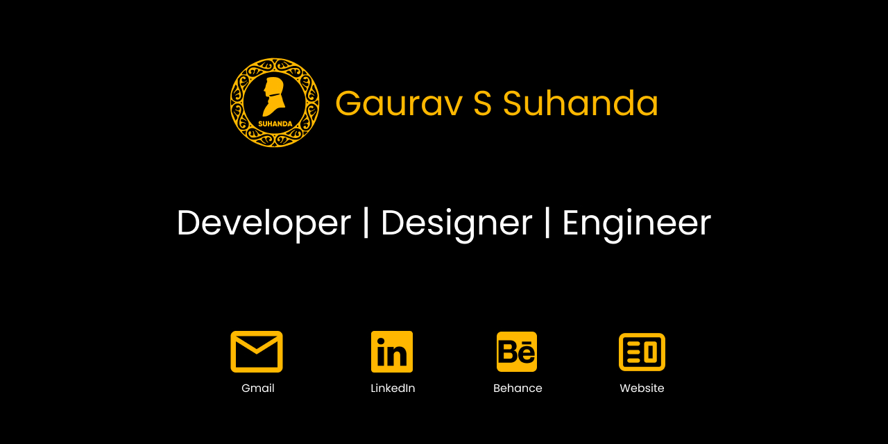

# My First Portfolio Website

Welcome to my first portfolio website! This site is a showcase of my work, skills, and experiences. You can explore my projects, learn more about my professional background, and connect with me. Feel free to visit the live site at the link below.

🌐 **[Visit My Portfolio](https://gauravsuhanda.github.io/)**

---

### What's Inside?

- **Projects:** A collection of my work across various domains, including web development, data science, and more.
- **Skills:** A detailed list of the technologies and tools I am proficient in.
- **About Me:** Insight into my background, interests, and career aspirations.
- **Contact:** Ways to get in touch with me for collaboration or inquiries.

---

### Technologies Used

- **HTML5**
- **CSS3**
- **JavaScript**
- **Responsive Design**
- **GitHub Pages**

---

### Get in Touch

If you have any questions or would like to collaborate, don't hesitate to reach out. You can contact me through the website or find me on

[LinkedIn](https://www.linkedin.com/in/gauravsuhanda/)
[Behance](https://www.behance.net/gaurs)

---

This README provides an overview of what you can expect on my portfolio website. If you have any feedback or suggestions, feel free to let me know.

---

